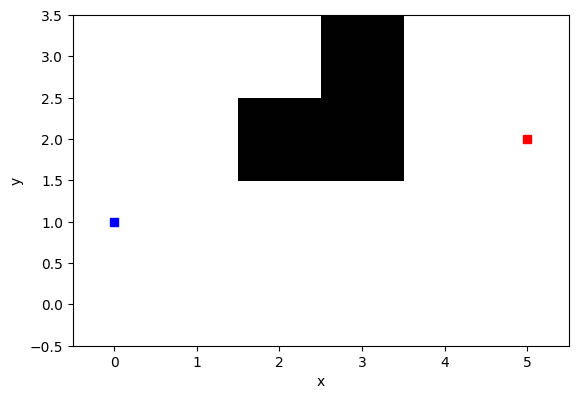

# Motion Planning 

## Overview
In this assignment, we implement some Search Based and Sampling Based motion planning algorithms to enable a robot catch a moving target. 

There are totally 11 scenes we test our motion planning algorithm. The 11 tests are implemented in **main.py** as functions `test_map0()`, `test_map1()`, ..., `test_map3c()`.

We implement variations of the A* algorithm such as Agent Centered Search and Anytime Search for the search based motion planning, and Rapidly Exploring Random Tree(RRT), RRTConnect algorithms for the sampling based motion planning algorithm. 

## Environment Setup

1. Create a conda environment using the ece276b.yaml file provided. 
<pre>conda env create -f ece276b.yaml </pre>
2. Activate the conda environment. 
<pre>conda activate ece276b </pre>

### File description

#### 1. robotplanner.py
This script contains all the Search Based motion planning algorithms implemented as python classes. We implement three classes : RTAA that implements the agent centered search, AnytimeA_star to implement the anytime search and A_star that implements a normal epsilon sub-optimal A* algorithm specifically for use in Map7 which is a challenging map because of its large size and complexity. To implement any algorithm, a planner of a particular class is created and then the plan() function of the object is called to get the next robot move. 

#### 2. targetplanner.py

This file contains the target planner. It uses the [minimax decisiton rule](https://en.wikipedia.org/wiki/Minimax) and tries to maximize the minimal distance the robot can achieve. You should not modify this file.

#### 3. main.py

This file contains test functions. It creates the planner as a particular  class of the Motion Planning algorithms and calls the plan() function of the planner object to get the next robot move. The file is run along with three possible command line arguments namely : ara to create an Anytime Search based planner, rtaa to create an Agent Centered Search based planner or rrt to create a Sampling Based RRT planner. After each robot move, the targetplanner function is called to get the next move of the target according to the MiniMax decision. The whole process is then repeated in a for loop until the robot catches up with the target. 
Usage : 
<pre>python3 main.py rtaa #Runs the agent centered planner</pre>
<pre>python3 main.py ara #Runs the anytime search planner</pre>
<pre>python3 main.py rrt #Runs the sampling based rrt planner</pre>

To run the motion planning algorithm on different test maps, change line 273 test_map portion to one of the test cases defined above. For ex :
<pre>caught, numofmoves = test_map1b()</pre>
<pre>caught, numofmoves = test_map5()</pre>

#### 4. rrt_connect.py
In this script, we try to implement the RRTConnect algorithm on the maps. Since vanilla RRT does not perform well in maze like maps, we try to see the performance of RRTConnect because it tries to construct trees from both the start and the goal and connects both the trees. Hence it is expected to atleast find a feasible path to the goal, although it may not be optimal. It is also possible that in certain runs, we don't find a path because of the limit on maximum number of samples to find the connection. 
Usage : 
<pre>python3 rrt_connect.py</pre>

## Directory
<pre>
starter_code
├── gif
│   ├── ara
│   └── rtaa
├── images
├── maps
├── __pycache__
└── src
│    ├── rrt
│    │   └── __pycache__
│    ├── search_space
│    │   └── __pycache__
│    └── utilities
│        └── __pycache__
│── main.py
│── robotplanner.py
│── targetplanner.py
│── modify_map.py
│── rrt_connect.py
</pre>
Results of the motion planning algorithm for the different test cases are shown in the gif folder and the images folder. 

## Technical report
* [Sambaran Ghosal. "Dynamic Programming for Deterministic Shortest Path problem" April 2022](report/ECE276B_Motion_Planning.pdf)

## Results
### Search Based Motion Planning(Left : Anytime , Right : Agent Centered)

Below we show the results for the different test maps using the agent centered and anytime search algorithms. 

| map0 |

 

| map1 |

 

| map1b |

 

| map2 |

 

| map3 |

 

| map3b |

 

| map3c |

 

| map4 |

 

| map5 |

 

| map6 |

 

For Map7, we got the epsilon sub-optimal A* algorithm working but were not able to make the Agent Centered Search work properly.

| map7 |

 

### Sampling Based Motion Planning(RRTConnect)
Finally, we present some results obtained by using the RRTConnect algorithm. It is able to find paths in complex maps like 3b and 1b that simple RRT was not able to find, but the path is not optimal. 

| map0 |

 

| map1 |

 

| map1b |

 

| map2 |

 

| map3 |

 

| map3b |

 

| map4 |

 

| map5 |

 

| map6 |

 

